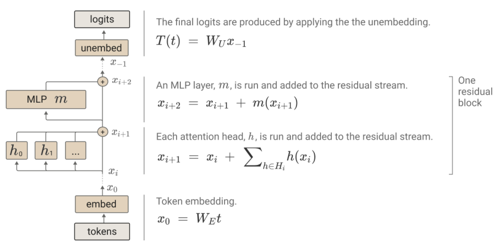

实现了GPT2的代码。
**大模型的整体思路**是：
- 收集数据
- 数据清洗
- tokenization
- 训练
- 概率采样

首先收集数据集的URL，然后对URL进行清洗(就是去掉yellow的网址)，再是爬虫爬取数据，随后对数据进行清洗(就是去掉HTML的标签)，对数据进行tokenization，即对内容按照语义划分成几块，比如对Beijing University of Posts and Telecommunications is an excellent university.进行划分，得到"Beijing"," University"," of"," Post","s"," and"," Telecommunication","s"," is"," an"," excellent"," university", "."。这是因为，一个单词，比如"language"比其他任意八个字母组成的意义更大，按照token划分，可以更快的训练神经网络，要不然训练半天可能输出还是"lw\<eo?d"，等训练两天才能输出"language"。但是这样词汇表就会很长，比如有50256个。训练是要把数据转化成神经网络能看懂的张量，就是onehot编码，把词汇表(长度50256)中对应位置写为1，其余位置为0，得到一个长度为50256的列表。使用神经网络训练即可。

训练时，对于一句话，先输入第一个token，预测输出，将输出与第二个token比对，将比较结果得到Loss用于训练神经网络(反向传播算法)，然后将前两个token输入神经网络，预测第三个token，将预测结果和实际结果比对，得到Loss用于训练，以此类推，一句话可以训练多次神经网络，可以加快训练效率。（这种预测当前词时只看这个词前面的内容，后面的内容看不到，叫做Musk，是一种因果注意力，前面的是因，后面的是果，不能用果来训练因，但是我觉得有些牵强，因为因果是在时间尺度上，对于可存储的情况和空间上，是没有因果律一说的，因为有种东西叫倒装句。）

数据输入到神经网络中后，输入的是token的编码，就是个张量，这个张量需要和token Embed作用，同时张量和Position Embed作用，token Embed告诉神经网络这个token是啥东西，Position Embed告诉神经网络这个token在一句话的哪个位置，（这边蕴含了一个道理，这个token具体是啥不重要，重要的是表达的含义、作用和所处的位置，比如“逻辑得分”，鬼知道是什么东西，但是这四个字不重要，重要的是明白它是在干一件什么事，马克思说，人是社会关系的总和，意思就是如此，我是谁不重要，把一只狗放在我这个位置，它就是我。它可以来上课，朋友见了打招呼，父母见了叫宝宝，它就是我。假设有一天，父母不认识我，派出所不承认我，我就不是我了）

具体神经网络就是下图这样，多头注意力$h(x_i)$提取位置的相关性，一起求和之后和原本$x_i$求和，构成的是个残差块(可参考何凯明的ResNet)，然后输出再经过MLP，MLP就是一个简单的神经网络，输出也是和输入求和到下一层，也是残差块的思想，这里需要注意信息可以走四条路：

不经过多头注意力，不经过MLP；经过多头注意力，不经过MLP；不经过多头注意力，经过MLP；经过多头注意力也经过MLP，一共四种情况，这样的多头注意力+MLP的组合会重复很多层，然后解嵌入，再逻辑得分，采样后输出。我们老师把这种结构叫大肚子结构。

简单说一下代码，data文件夹里存放数据集，是wikitext的数据集，result里面存在结果，会绘制loss的折线图，并存放训练好的模型model.pt，tokenizer是用来词元化的，config.py存放一些超参数，utils.py对数据集做tokenization，model.py存放模型，train.py是训练的代码，infer.py是测试的代码。由于我是在AutoDL算力云上租的显卡，用的jupyterLab，所以需要在Untitled.ipynb运行main函数，在Untitled.ipynb里面输入
```
!python main.py
```
就可以训练模型，等训练结束后，在Untitled.ipynb里输入
```
!python infer.py
```
开始测试，因为gpt2是个续写器，所以得写个开头，开头在infer里最明显的一个地方加入，你也可以自己用input来实现可交互性，但是这在Jupyter里似乎不太行。
对了，记得在运行之前安装需要的库，如果遇到版本冲突的问题，请让它别冲突。

一个门外汉写的一点东西，如果有错误还请谅解，如果有侵权联系我就删。
